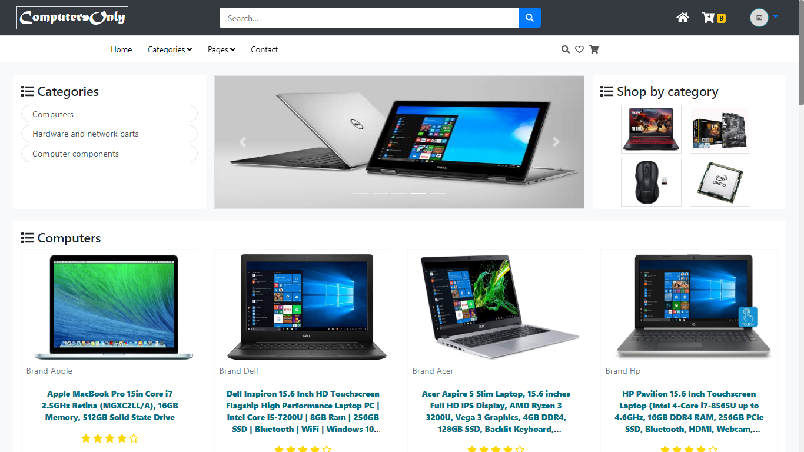
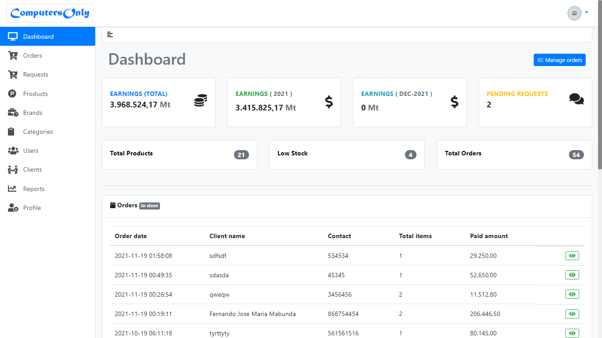
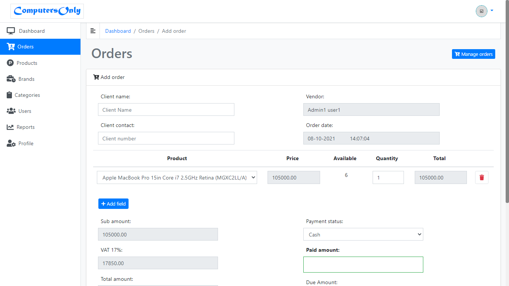

# SalesSystem_StockControl

## DASHBOARD

## Used Technologies:
### Front-End:
- HTML5
- CSS3
- JavaScript

### Back-End:
- PHP
- MySQL

## Prerequisites
### How to use the system

1. Configure your database connection credentials in the file located in the 'dataBase' folder with the name 'store.sql';
2. Simply execute the SQL code from the store.sql file located in the dataBase folder;
3. Host the project on a localhost.

## Files

### JQuery

#### AJAX Search, Sort, Range, Filter & Paginate

In this project, you can perform Search, Sort, Filter, Range, and Pagination, all working together.

1. Ajax Search
2. Ajax Sort
3. Ajax Filter
4. Ajax Range-Slider
5. Ajax Pagination
6. Ajax Refine Search

#### Multi Languages

**MultiLanguage** site; It contains two languages, English and Portuguese.

## Resources

## Features:
### General Public Users:
- Search for a product
- View a product
- Create a user account

### Authenticated Users (Employees):
- Search Product
- View Product
- Create Order
- Change Email & Password
- View Previous Orders with UPDATE and DELETE

### Authenticated Users (Customers):
- Can create a shopping cart
- Add products to the shopping cart
- 
- Change Email & Password
- Can view the cart, change quantity, or remove added products

### Administrators:
- Add New Product
- Update, Delete Product
- Confirm Order

---

## DASHBOARD

## ORDERS

## Developer

Joao Chirindza -> MailTo: johnchirindza@gmail.com | Web portfolio: [https://jchirindza.vercel.app/](https://jchirindza.vercel.app/)
